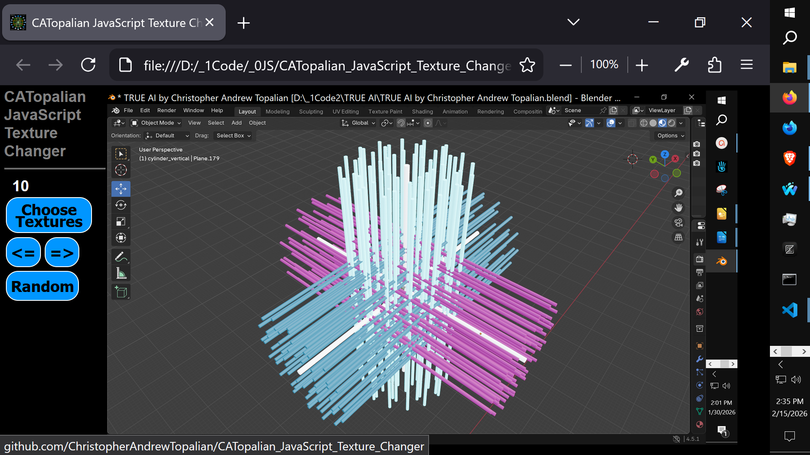

# CATopalian JavaScript Texture Changer
A JavaScript app that allows the user to choose multiple textures from any folder, go forward, backward and choose random textures from the files loaded.

---

Video: https://www.youtube.com/watch?v=V-2E6KAXCSc

---

### How to Download this App
1. Click the green Code Button on this github page
2. Choose Download ZIP
3. Save the Zip File
4. Extract All
5. Double click the HTML file to start the App

---

Happy Scripting :-)

---

// Dedicated to God the Father  
// All Rights Reserved Christopher Andrew Topalian Copyright 2000-2026  
// https://github.com/ChristopherTopalian  
// https://github.com/ChristopherAndrewTopalian  
// https://sites.google.com/view/CollegeOfScripting

